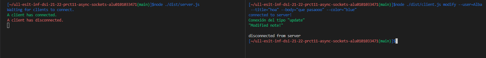
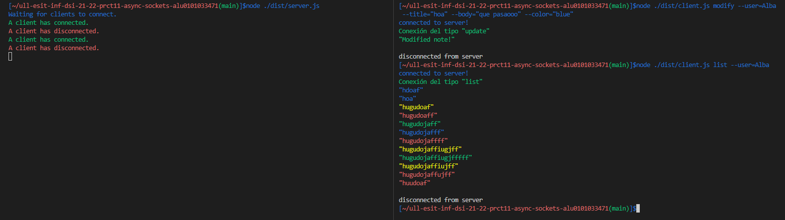
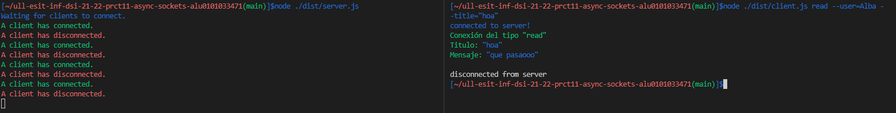
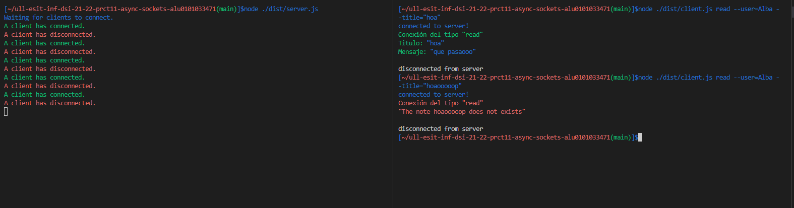

# Informe de la actividad
Práctica sobre una aplicación de procesamientos de notas de texto. Donde se permite añadir, modificar, eliminar, listar y leer notas de un usuario concreto. Además,  las notas se almacenarán como ficheros JSON. Todo esto debe ser implementado con un servidor y un cliente haciendo uso de los sockets proporcionados por el módulo net de Node.js.

## Desarrollo
Para el desarrollo de esta práctica se ha contado con un servidor  en **server.ts**, un cliente en **client.ts**, 5 clases por cada procesamiento de nota en 5 ficheros , 5 clases para los comandos del paquete **yargs**.

## Estructura
Para el siguiente ejercicio se prepararon las mismas clases que en la práctica 9 pero con disintas variaciones, para separar las funcionalidades de código y **yargs** por separado.:
* En **add_yargs.ts**, la clase  **Add** con un método que implementa la herramienta **yargs** para crear un type **RequestType** y pasarlo como dato del cliente al servidor y en **add.ts**, la clase  **Add** para poder añadir notas de texto y crear los directorios donde se van a almacenar segundo el usuario que ejecute el comando.
* En **list_yargs.ts**, la clase  **List** con un método que implementa la herramienta **yargs** para crear un type **RequestType** y pasarlo como dato del cliente al servidor y en **list.ts**, la clase  **list** para poder listar las notas de texto de un usuario.
* En **read_yargs.ts**, la clase  **Read** con un método que implementa la herramienta **yargs** para crear un type **RequestType** y pasarlo como dato del cliente al servidor y en **read.ts**, la clase  **Read** para poder leer una nota en concreto de un usuario.
* En **remove_yargs.ts**, la clase  **Remove** con un método que implementa la herramienta **yargs** para crear un type **RequestType** y pasarlo como dato del cliente al servidor y en **remove.ts**, la clase  **Remove** para poder eliminar una nota en concreto de un usuario.
* En **modify_yargs.ts**, la clase  **Modify** con un método que implementa la herramienta **yargs** para crear un type **RequestType** y pasarlo como dato del cliente al servidor y en **modify.ts**, la clase  **Modify** para poder modificar una nota en concreto de un usuario.

Las notas han sido creadas y almacenadas de la misma manera que en la practica 9.

## Código

### Clases Add, List, Remove, Modify y Read en los archivos *_yargs.ts
Las clases mencionadas cuenta con un método que se encarga de usar la herramienta **yargs** con sus respectivos comando que se pasarían por linea de comandos. Su función es comunicar al **cliente** con el **servidor** pasandole un resultado en **RequestType** para su uso en el **servidor**.

Ejemplo del comando add
```typescript
  handler(argv) {
    let request: RequestType = {
      type :  'add',
      user: String(argv.user),
      title : String(argv.title),
      body : String(argv.body),
      color :  String(argv.color),
      
    } 
    client.write(JSON.stringify(request, null, 2));
  },
```

Ejemplo del comando read
```typescript
 handler(argv) {
  let request: RequestType = {
    type :  'read',
    user: String(argv.user),
    title : String(argv.title),
  } 
  client.write(JSON.stringify(request, null, 2));
},
```

### Cliente 

En el **client.ts** se crea un type **RequesType** con el tipo de comando y como parametros arbitrarios, un usuario, un titutlo, un cuerpo de mensaje y un color. Este type es el parametro que se le pasa al **Servidor**
```typescript
type RequestType = {
  type: 'add' | 'update' | 'remove' | 'read' | 'list';
  user?: string;
  title?: string; 
  body?: string;
  color?: string;
}
```

Tras iniciar el cliente se ejecuta el **yargs.parse()** y dentro de cada comando, como se mostro anteriormente se pasa la información al servidor.

```typescript
const client = net.createConnection({ port: 60300 }, () => {
  yargs.parse();
  console.log('connected to server!');
});
```
Para leer la información que pueda recibir del servidor, con el método **on** se leera los datos pasados a String.
```typescript
client.on('data', (data) => {
  console.log(data.toString());
  client.end();
});
```

### Servidor

En el server.ts se crea un type **ResponseType** y se crean para su transformación un type **ResponseType** y otro **RequestType**. 
En el caso del **ResponseType**, tiene como parametros el tipo del comando, **succes** para determinar si el mensaje que se le va a devolver al cliente es de color rojo o verde dependiendo de si es true o false. Y un parametro note donde almacenaremos el mensaje del comando que ejecutamos y que queremos pasar al **cliente**.
```typescript
type ResponseType = {
  type: 'add' | 'update' | 'remove' | 'read' | 'list';
  success: boolean;
  notes?: string[];
}

let a: RequestType;
let b: ResponseType;
```

Al crear el servidor y establecer conexión con un cliente, pasamos a nuestra variable **a** del tipo **RequestType** la información proporcionada por el cliente para poder decidir dependiendo del type de la variable **a** que objeto instanciamos y de que clase.
```Typescript
const server = net.createServer((connection) => {
  console.log(chalk.green('A client has connected.'));

  connection.on('data', (data) => {
    a = JSON.parse(data.toString());
    if(a.type === `remove`){
      const removeOpcion = new Remove();
      b = removeOpcion.removeNote(a);
    } else if (a.type === `list`){
      const listOpcion = new List();
      b = listOpcion.listNote(a);
    } else if (a.type === `add`){
      const addOpcion = new Add();
      b = addOpcion.addNote(a);
    } else if (a.type === `read`){
      const readOpcion = new Read();
      b = readOpcion.readNote(a);
    } else {
      const modifyOpcion = new Modify();
      b = modifyOpcion.modifyNote(a);
    }
```

Todos las clases creadas para el tratamiento de notas son casi identicas a las creadas en la práctica 9 con la diferencia de que sus métodos necesitan recibir por parámetro un  **RequestType** y devuelven un ResponseType. 
   
Ejemplo del método en la clase Add.
```typescript
 class Add {
  constructor(){}
  addNote(a: RequestType):ResponseType{
    
    let b: ResponseType = {
      type: a.type,
      success: true,
      notes: [],
    }
    if (!fs.existsSync(`./dist/${String(a.user)}`)){
      fs.mkdir(path.join(__dirname, String(a.user)), (err) => {
        if (err) {
          b.success = false;
          b.notes?.push(String(err));
          return b;
        }
      });
    }
    if (fs.existsSync(`./dist/${a.user}/${a.title}.json`)){
      b.success = false;
      b.notes?.push('Note title taken!');
      return b;
    }
    else{
      let info = {
        title: String(a.title),
        body: String(a.body),
        color: String(a.color),
      };
      let data = JSON.stringify(info, null, 2);
      
        fs.writeFile(`./dist/${a.user}/${a.title}.json`, data, (err) => {
          if (err) {
            b.success = false;
          b.notes?.push(String(err));
          return b;
          }
        });
        b.notes?.push(`New note added!`);
        return b;
    }
  }   
}
```

Tras ejecutar el método de una clase en el servidor para elegir que devolver al cliente,
dependiendo del **type** y el **success** de la variable **a** que almacena el resultado de las clases, se va a decidir que tipo de mensaje se va a enviar de vuelta al cliente.
```typescript
 if(a.type === `list` && b.success === true){
    connection.write(chalk.green(`Conexión del tipo ${JSON.stringify(b.type,null,2)}`+
    '\n'));
    b.notes?.forEach(element => {
    let jsonData = require(`./${String(a.user)}/${String(element)}.json`);
    connection.write(chalk[`${jsonData.color}`](JSON.stringify(element,null,2) +
    '\n'));
     });
   } else if (a.type === `read` && b.success === true) {
    connection.write(chalk.green(`Conexión del tipo ${JSON.stringify(b.type,null,2)}`+
    '\n'));
    let jsonData = require(`./${String(a.user)}/${String(b.notes?.[0])}.json`);
    connection.write(chalk.green(`Titulo: `));
    connection.write(chalk[`${jsonData.color}`](JSON.stringify(b.notes?.[0],null,2) +
    '\n'));
    connection.write(chalk.green(`Mensaje: `));
    connection.write(chalk[`${jsonData.color}`](JSON.stringify(b.notes?.[1],null,2) +
    '\n'));
   } else if (b.success === true) {
    connection.write(chalk.green(`Conexión del tipo ${JSON.stringify(b.type,null,2)}`+
    '\n'));
    connection.write(chalk.green(JSON.stringify(b.notes?.[0],null,2) +
    '\n'));
   } else {
    connection.write(chalk.red(`Conexión del tipo ${JSON.stringify(b.type,null,2)}`+
    '\n'));
    connection.write(chalk.red(JSON.stringify(b.notes?.[0],null,2) +
    '\n'));
   }
  });
```


Gracias a este código, se puede ejecutar un cliente con el paquete **yargs** con el comando que se quiere llevar a cabo, conectarse con un servidor que va a tratar la información y devolver el mensaje que se espera por el cliente.

## Ejemplos de Resultados









## Test Unitario y coveralls
En cuanto a los test y coveralls, no se ha podido llevar a cabo de buena manera fallando en este apartado importante.

## Conclusion
En esta actividad se ha comenzado a trabajar con servidores y clientes haciendo uso de los sockets proporcionados por el módulo net de Node.js. Como dato a mejorar, la realización de test unitarios. Los test unitarios no son un punto fuerte del alumno que realiza este proyecto, necesitando estructurar los proyectos de mejor manera para dichos test.